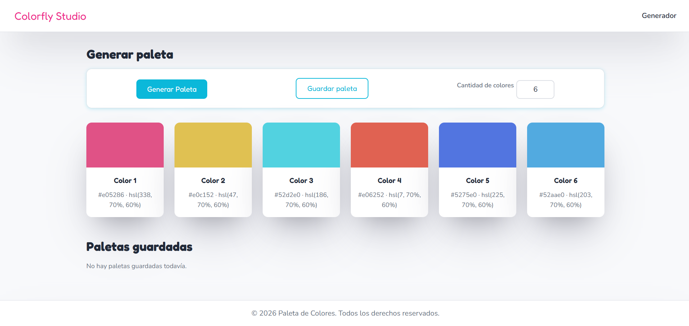
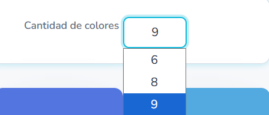
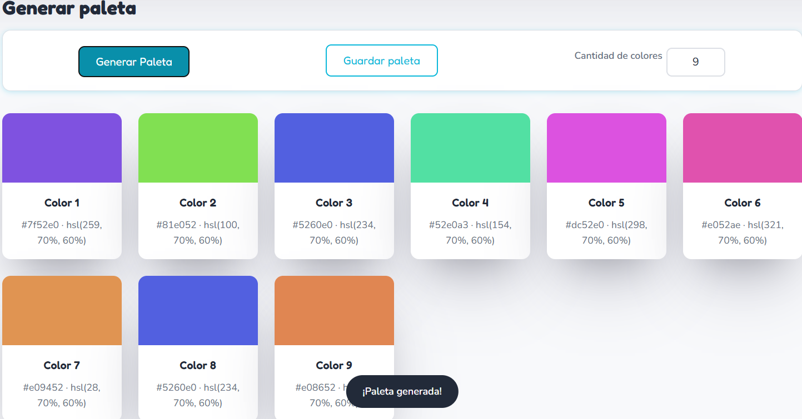
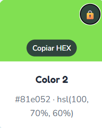
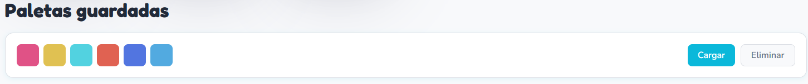

# 🎨 Colorfly Studio — Generador de Paletas de Colores

Proyecto Integrador — Módulo 1 · Henry Full Stack 3.0 + IA  
**Desarrollador:** Braian Steven Martínez Zabala

🔗 [Demo en vivo](https://stivenzbl.github.io/ProyectoM1-StivenZabala/) · [Repositorio](https://github.com/Stivenzbl/ProyectoM1-StivenZabala)

---

## ¿Qué es esta aplicación?

Herramienta web para Colorfly Studio que permite generar paletas de colores aleatorias de forma rápida e intuitiva. Pensada para acelerar el flujo creativo del equipo de branding.

---

## Funcionalidades

### Obligatorias
- Botón "Generar paleta" que genera colores aleatorios
- Selector de cantidad: 6, 8 o 9 colores
- Visualización de cada color con su código HEX y HSL
- Toast de microfeedback al generar una paleta

### Extra credit implementado
- **Copiar HEX al portapapeles** — clic sobre el color, tooltip de confirmación
- **Bloqueo de colores** — candado por swatch para fijar colores al regenerar
- **Guardar paletas en localStorage** — persisten al recargar la página
- **Cargar paletas guardadas** — restaura una paleta guardada con un clic
- **Animaciones sutiles** — entrada de swatches con fade + translateY

---

## Tech Stack

| Tecnología | Uso |
|---|---|
| HTML5 semántico | Estructura (`header`, `main`, `section`, `article`, `footer`) |
| CSS3 | Variables, Flexbox, Grid, animaciones, accesibilidad |
| JavaScript (vanilla) | DOM, eventos, localStorage, Clipboard API |
| Git / GitHub | Versionado con commits descriptivos |
| GitHub Pages | Deploy de producción |

---

## Estructura del proyecto

```
ProyectoM1-StivenZabala/
├── index.html
├── css/
│   └── styles.css
├── js/
│   └── index.js
└── Documentación/
    ├── README.md
    ├── uso-de-ia.md
    └── capturas/
```

---

## Cómo ejecutar localmente

1. Clona el repositorio:
```bash
git clone https://github.com/Stivenzbl/ProyectoM1-StivenZabala.git
```

2. Abre `index.html` en tu navegador — no requiere servidor ni dependencias.

---

## Cómo desplegar en GitHub Pages

1. Ve a **Settings → Pages** en el repositorio
2. En *Branch*, selecciona `main` y carpeta `/ (root)`
3. Guarda — en unos minutos la app estará disponible en la URL pública

---

## Vista previa

### Vista general


### Selector de cantidad de colores


### Toast de microfeedback al generar


### Tooltip y bloqueo de color


### Paletas guardadas


## Decisiones técnicas

**Generación de colores en HSL**  
Se eligió HSL como formato de generación porque permite controlar saturación y luminosidad de forma predecible (`70%, 60%`), garantizando colores siempre vibrantes y legibles. El HEX se calcula a partir del HSL con una función de conversión matemática propia.

**localStorage para persistencia**  
Las paletas guardadas se serializan como JSON en `localStorage` bajo la clave `"paletas"`. Cada paleta tiene un `id` basado en `Date.now()` para poder eliminarlas individualmente.

**Bloqueo de colores**  
El estado de bloqueo se gestiona en el array `paleta[]` en memoria. Al regenerar, `renderPaleta()` omite los índices bloqueados y reutiliza su color anterior.

**Accesibilidad**  
- Labels asociados al select mediante `for` / `id`  
- `aria-live="polite"` en la galería para lectores de pantalla  
- `aria-label` en botones de candado  
- `:focus-visible` con outline visible en inputs y swatches  
- Contraste de texto verificado sobre fondos claros

---

## Autor

**Braian Steven Martínez Zabala**  
Estudiante Full Stack — Henry Bootcamp 3.0  
[GitHub](https://github.com/Stivenzbl)
